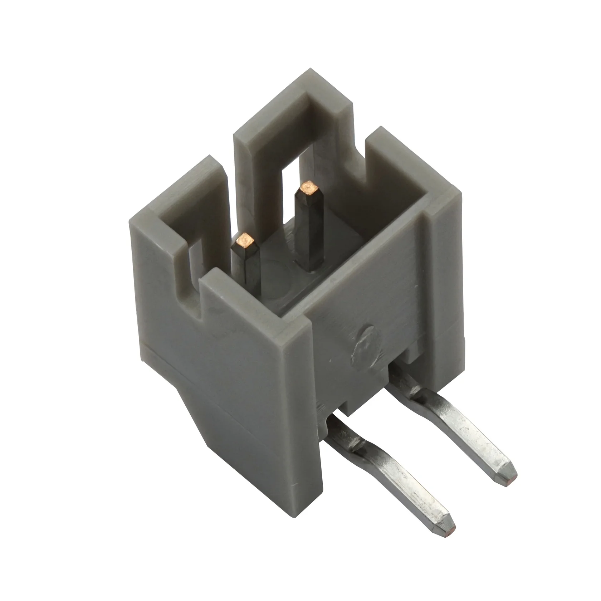
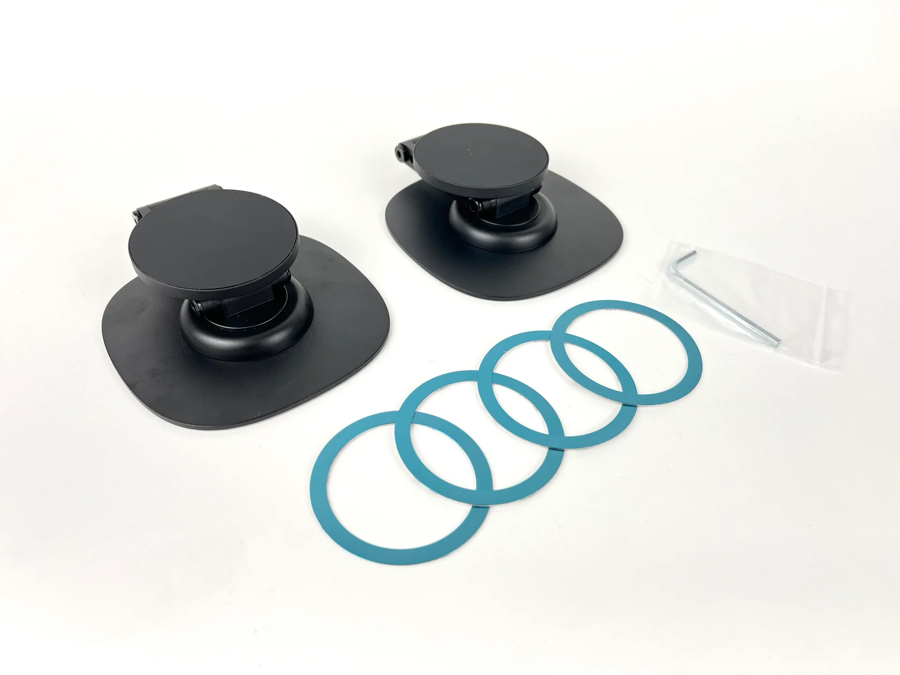
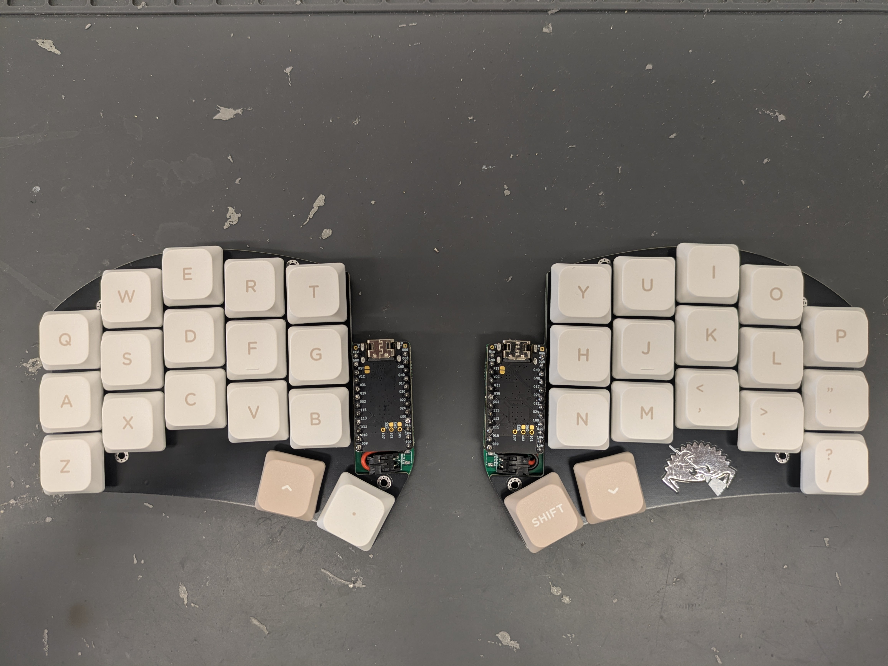

[Head Repository](https://github.com/davidphilipbarr/Sweep)

# Sweep Gateron

Wireless Ferris Sweep with Gateron KS-33 switches and [Nyphy COAST Dawn](https://nuphy.com/collections/keycaps/products/coast-dawn-nsa?_pos=16&_fid=9b29c1ae1&_ss=c) keycaps

A modified Ferris Sweep for [Gateron KS-33 switches](https://www.gateron.co/products/gateron-low-profile-mechanical-switch-set) ([hotswap sockets](https://www.gateron.com/products/gateron-low-profile-switch-hot-swap-pcb-socket?VariantsId=10234) required).

## Variants
- [Basic](./Sweep%20Gateron/) - MX spacing, based on the [Sweep High](https://github.com/davidphilipbarr/Sweep/tree/main/Sweep%20High).
- [JST](./Sweep%20Gateron/jst/) - Same as the basic version, but the TRS jack is replaced with a 2-pin JST connector for the battery in wireless builds (and the reset button is moved). **Wireless only**.

Both variants support a [switch plate](./Sweep%20Gateron/switch-plate/) and [bottom plate](./Sweep%20Gateron/bottom-plate/).

## Components
Unless otherwise stated, this Sweep uses the same components as the base Sweep.

- The JST connector for the JST version is from [typeractive](https://typeractive.xyz/products/battery-jack).

- This board *does not* support a tenting puck, but great alternatives are tenting kickstands (from [typeractive](https://typeractive.xyz/products/battery-jack))
 or MagSafe tenting stands (from [Keebio](https://keeb.io/products/magnetic-magsafe-tenting-stand-kit-for-split-keyboard-r2)).

## Gallery
### Front

### Back

## Notes
- If you edit this board, be aware that the schematic files are affected by [#75](https://github.com/davidphilipbarr/Sweep/issues/75). The PCB files are correct according to the software pinout, however, and will be manufactured correctly.
